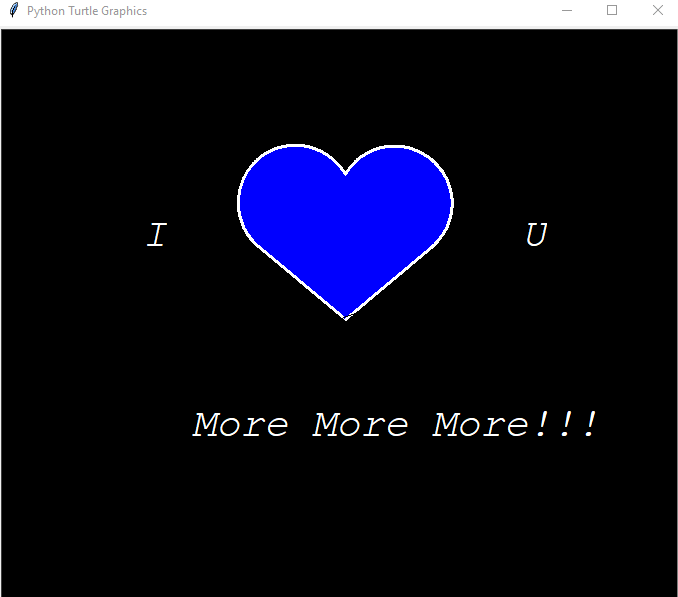

# Python To Your Crush

1. Buka Visual studio code atau, Python, atau semacamnya.
2. Created file.
3. Copy file.
4. Paste File ke Visual studio code, Python atau semacamnya.
5. Running file.

## Screenshots

    
## Feedback

If you have any feedback, please reach out to us at zidanfebryan95@gmail.com

